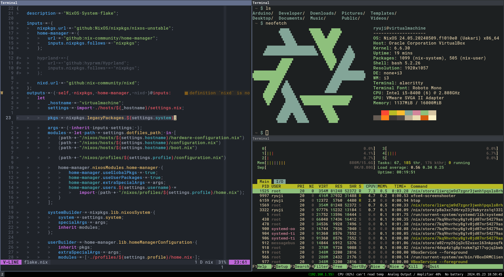
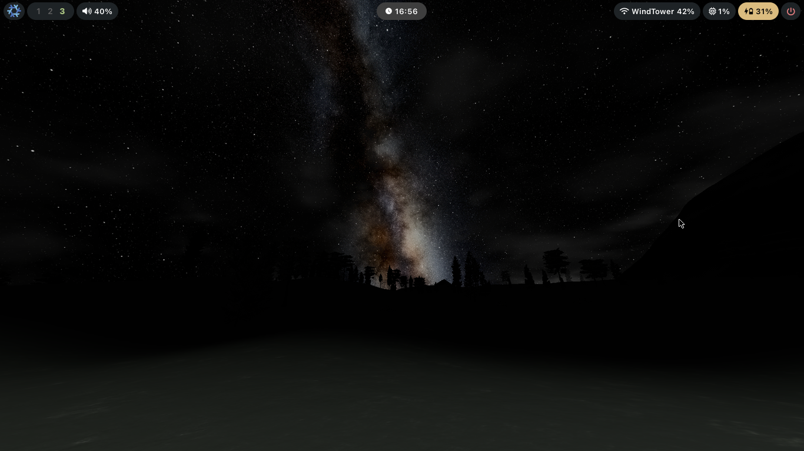

> ⚠️ My dotfiles had an incident >:(
>
> This is why all commits before a certain point report
> the date of the incident and at least 8 commits got lost (as far as I know)

> ℹ️ My dotfiles are divided in 3 branches:
>
> - `main`: Oldest "stable" version (fully "compatible" with macos)
> - `nixos-compliant`: (CURRENT) Stable version of nixos, preferred but not updated
> - `nixos-compliant-unstable`: Switched to unstable to configure hyprland
>
> Graph
>
> ```plaintext
> * 16d55fd main
> |\
> | * 88e48b9 nixos-compliant (nixpkgs-23.05)
> | |\
> | | * cfb1ed0 nixos-compliant-unstable (nixpkgs/unstable)
> | | |
> | |/
> | * 2c6a8c9 nixos-compliant (nixpkgs-24.05)
> ' |
>   v
> ```

# Dotfiles

These are my dotfiles, feel free to use them and
share with me any feedback or trick you may know :p

> Virtual machine notes
>
> - Remember to enable `settings.runningVM` in `nixos/hosts/HOST/settings.nix`
> - Nixos doesn't like default graphics driver, use `VBoxVGA`
> - Hyrpland may not work in a VM, try but it's not assured

---


> "Xfce", i3, i3status, nvim and zsh showcase


> "Hyprland", waybar, wallpaper showcase


> Plymouth darnix theme (custom)

---

## Overview

These are all my dotfiles which are compatible with or
without (or at least that's the goal) nix/NixOS installed

- `Operating System`: NixOS
- `Terminal`: Alacritty
- `Editor`: Nvim (trying emacs tho...)

|                | XServer  | Wayland  |
| -------------: | -------- | -------- |
| Window manager | i3       | hyprland |
| Status bar     | i3status | waybar   |
| App launcher   | dmenu    | wofi     |

Included configuration files

- Alacritty \[v0.12.2\] ([Github](https://github.com/alacritty))
- Clang \[7.0.1-8\] ([Docs](https://clangd.llvm.org/config.html))
- Clang-format \[7.0.1-8\] ([Docs](https://releases.llvm.org/7.0.0/tools/clang/docs/ClangFormatStyleOptions.html))
- Hyprland (WIP)
- i3 \[4.16.1\] ([Docs](https://i3wm.org/docs/userguide.html), [statDocs](https://i3wm.org/docs/i3status.html))
- MangoHud (WIP)
- NixOS \[v23.11\]
- Nvim \[v0.9.1\] ([Github](https://github.com/neovim))
- Plymouth \[v24.004.60\] ([Gitlab](https://gitlab.freedesktop.org/plymouth/plymouth))
- Waybar \[v0.10.3\] ([Github](https://github.com/Alexays/Waybar))
- Zsh \[5.7.1\]

## Special Requirements

- Font: `Roboto Mono` [Link](https://github.com/googlefonts/RobotoMono.git) (For Alacritty)

## Installing Configuration

1. Cloning repo

```bash
DOT_FILES="${HOME}/.config/dotfiles" # or /.dotfiles
git clone https://github.com/JustCoderdev/dotfiles.git "${DOT_FILES}"
cd "${DOT_FILES}"
```

2. Running installer

    - Without nix

    ```bash
    ./mount-configs.sh
    ```

    - With nix stuff (home-manager)

    ```bash
    cd nixos
    nix build ".#${USER}"
    ./result/activate
    ```

    - With NixOS

    ```bash
    cd nixos
    ./install.sh
    ```

## NixOS file structure

In the `nixos` directory there are the configuration files for nixos (duh)
and are arranged as follows:

- `profiles`: Module importers (currently only `personal`)
- `hosts`: Specific computer configurations (hw-config, settings and boot config)
- `modules`:
	- `unofficial`: Home-made nix modules
	- `common`:
		- `core`: Required stuff from all systems (hardware, etc...)
		- `users`: Per user settings
	- `system`:
		- `bin`: Custom script binaries
		- `desktop`: Desktop env stuff
		- `dev`: Dev shit
		- `gaming`: Gaming stuff
		- `services`: Daemons and what not
	- `user`: Per app configs (home-manager)

## Inspiration

- Jdah dotfiles ([Github](https://github.com/jdah/dotfiles))
- Librephoenix dotfiles ([Gitlab](https://gitlab.com/librephoenix/nixos-config))
- EmergentMind nixos configuration ([Github](https://github.com/EmergentMind/nix-config))
- erictossel nixos configuration ([Github](https://github.com/erictossell/nixflakes))
- mrkux nixos configuration ([Github](https://github.com/mrkuz/nixos))
- Sane1090x Waybar style ([Github](https://github.com/sane1090x/dotfiles/blob/everforest/.config/waybar/config))
- Ruixi-rebirth waybar idea ([Github](https://github.com/Ruixi-rebirth/flakes/blob/main/home/programs/waybar/hyprland_waybar.nix))

## Emergency wiki

### Recover rollback dotfiles

```bash
# Get backup path
nix derivation show -r /run/current-system \
        | grep --color -E '"out": "/nix/store/.*dotfiles-backup"'

# Open backup path (EXPERIMENTAL)
current-dotfiles
```

### Connect to internet (with wpa_supplicant)

```bash
sudo ip link set dev <if> up
sudo rfkill unblock wifi
sudo mkdir /etc/wpa_supplicant

wpa_passphrase <ESSID> <PASSWD> | sudo tee -a /etc/wpa_supplicant/wpa_supplicant.conf
sudo wpa_supplicant -B -c /etc/wpa_supplicant/wpa_supplicant.conf -i <if>
```

### Connect to internet (with nmcli)

```bash
nmcli device wifi rescan
nmcli device wifi list
nmcli device wifi connect <SSID> password <password>
```

### Connect to bluetooth

```bash
bluetootctl scan on
bluetootctl list
bluetootctl connect <ADDRESS>
```

### Enable ssh connection

```bash
sudo apt-get install openssh-server
sudo systemctl enable ssh
sudo systemctl start ssh
sudo systemctl status ssh
```

### Check battery level

```bash
cat /sys/class/power_supply/<BAT>/status
cat /sys/class/power_supply/<BAT>/charge_now
cat /sys/class/power_supply/<BAT>/charge_full
```


