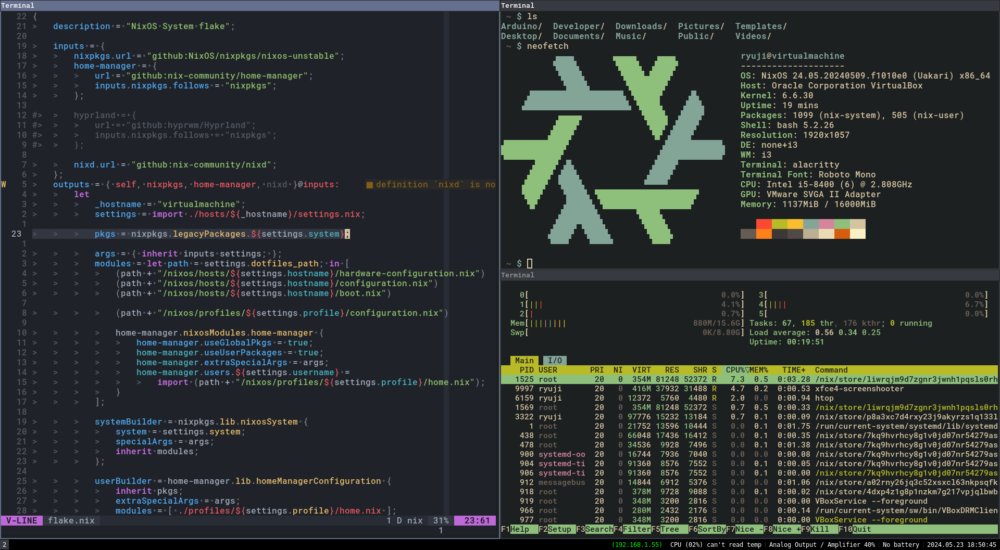
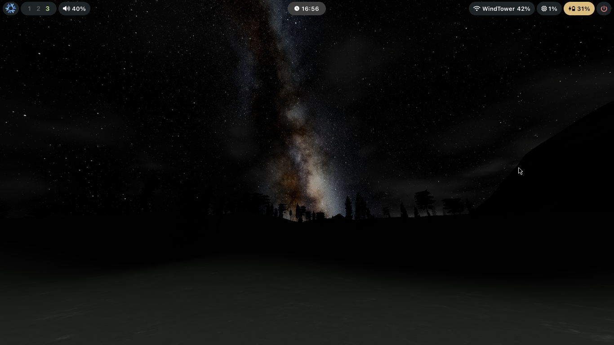

> `/!\` My dotfiles had an incident
>
> This is why all commits before a certain point report
> the date of the incident and at least 8 commits got lost (as far as I know)

> `(i)` My dotfiles are divided in 4 branches:
>
> - `main`: Oldest "stable" version (fully "compatible" with macos)
> - `nixos-integration`: (CURRENT) Restructuring of nixos w better flakes
> - `nixos-compliant`: [DEPRECATED] Messy stable version of nixos
> - `nixos-compliant-unstable`: [DEPRECATED] Switched to unstable to configure hyprland

```plaintext
* 16d55fd main
|\
| * 88e48b9 nixos-compliant (nixpkgs-23.05)
| |\
| | * cfb1ed0 nixos-compliant-unstable (nixpkgs/unstable)
| | |
| |/
| * 2c6a8c9 nixos-compliant (nixpkgs-24.05)
| |
| * 0be0f74 nixos-compliant (nixpkgs-24.11)
' |
  * 91c5ef1 nixos-integration (nixpkgs-24.11)
  v
```

# Dotfiles

These are my dotfiles, feel free to use them and
share with me any feedback or trick you may know :p

> Virtual machine notes
>
> - Remember to enable `host.isVM` in `nixos/hosts/HOST/settings.nix`
> - Nixos doesn't like default graphics driver, use `VBoxVGA`
> - Hyrpland may not work in a VM

---


> "Xfce", i3, i3status, nvim and zsh showcase

---


> "Hyprland", waybar, wallpaper showcase

---


> Plymouth darnix theme (custom)

---

## Overview

These are all my dotfiles which are compatible with or
without (or at least that's the goal) nix/NixOS installed

- `Operating System`: NixOS
- `Terminal`: Alacritty
- `Editor`: Nvim (trying emacs tho...)

|                | XServer  | Wayland  |
| -------------- | -------- | -------- |
| Window manager | i3       | hyprland |
| Status bar     | i3status | waybar   |
| App launcher   | dmenu    | wofi     |

Included configuration files

[standalone] firefox - tmux

- Alacritty \[\>v0.12.2\] ([Github](https://github.com/alacritty))
- Clang \[\>7.0.1-8\] ([Docs](https://clangd.llvm.org/config.html))
- Clang-format \[\>7.0.1-8\] ([Docs](https://releases.llvm.org/7.0.0/tools/clang/docs/ClangFormatStyleOptions.html))
- Emacs (WIP)
- Fusuma (WIP)
- Git
- Hyprland (WIP)
- i3 \[\>4.16.1\] ([Docs](https://i3wm.org/docs/userguide.html), [statDocs](https://i3wm.org/docs/i3status.html))
- Neovim \[\>v0.9.1\] ([Github](https://github.com/neovim))
- NixOS \[\>v23.11\]
- Plymouth \[\>v24.004.60\] ([Gitlab](https://gitlab.freedesktop.org/plymouth/plymouth))
- Waybar \[\>v0.10.3\] ([Github](https://github.com/Alexays/Waybar))
- Zsh \[\>5.7.1\]


## Special Requirements

- Font: `Roboto Mono` [Link](https://github.com/googlefonts/RobotoMono.git) (For Alacritty)
- Font: `SF Pro Text` [Link](https://developer.apple.com/fonts) (For Waybar)

## Special Global Variables

- `DOT_NIXOS`: `1` if the system is using the nixos configuration otherwise unset
- `DOT_FILES`: The absolute path to the dotfiles folder (currently hardcoded in zsh.nix)
- `DOT_NIX_SUB_URL`: The url to a nix substituter
- `DOT_NIX_SUB_PORT`: The port of the nix subsituter

## Installation guide

1. Clone

```bash
DOT_FILES="${HOME}/.config/dotfiles" # or /.dotfiles
git clone https://github.com/JustCoderdev/dotfiles.git "${DOT_FILES}"
cd "${DOT_FILES}"
```

2. Install

- Without nix

```bash
./bin/bash-scripts/mount-configs.sh
```

- With nix stuff (home-manager)

```bash
cd confs

# add after nix "--extra-features 'nix-command flakes'" if using a non-flake env
nix build .#${USER}-activation

./result/activate
```

- With NixOS

> If you get a "relative path error for ./bin..."
>
> - Remove local inputs from flake.nix (jcbin and jcconfs)
> - Start rebuild `./bin/bash-scrips/rebuild-system.sh`
> - Wait for rebuild to fail
> - Add local inputs back

```bash
./install.sh
```

## Dotfiles structure

There are 3 main directories:

- `bin`: various scripts available in a flake
- `confs`: application configuration files (w home-manager support)
- `nixos`: nixos system modules

### confs

- `.wallpapers`: wallpapers for sway
- `settings`: User settings (username and insecure/unfree packages list)
- `users`: Available users
- `standalone`: Configurations that exists only in home-manager

### nixos

- `unofficial`: Home-made nix modules
- `hosts`: Computer bound configuration (boot, hw and options configuration)
- `common`:
    - `core`: Required stuff from all systems (net, font, etc...)
    - `users`: Per user settings
- `system`:
    - `desktop`: Desktop env stuff
    - `dev`: Dev shit
    - `gaming`: Gaming stuff
    - `services`: Daemons and what not


## Inspiration

- Jdah dotfiles ([Github](https://github.com/jdah/dotfiles))
- Librephoenix dotfiles ([Gitlab](https://gitlab.com/librephoenix/nixos-config))
- EmergentMind nixos configuration ([Github](https://github.com/EmergentMind/nix-config))
- erictossel nixos configuration ([Github](https://github.com/erictossell/nixflakes))
- mrkux nixos configuration ([Github](https://github.com/mrkuz/nixos))
- Sane1090x Waybar style ([Github](https://github.com/sane1090x/dotfiles/blob/everforest/.config/waybar/config))
- Ruixi-rebirth waybar idea ([Github](https://github.com/Ruixi-rebirth/flakes/blob/main/home/programs/waybar/hyprland_waybar.nix))
- XeIaso doublas-adams-quotes for making me discover the power of flakes ([Github](https://github.com/Xe/douglas-adams-quotes/blob/main/flake.nix)[XeIasoBlog](https://xeiaso.net/))

## Obtaining Secrets

> All secrets are "indexed" in `nixos/common/core/secrets.nix`

### Cloudflared

```
cd ${DOT_FILES}/secrets/cloudflare

nix-shell -p cloudflared --command 'cloudflared login'
mv /home/${USER}/.cloudflared/cert.pem .

cloudflared tunnel --origincert "$(pwd)/cert.pem" create home
mv *.json home.json
```

### WPA Supplicant psk

```
cd ${DOT_FILES}/secrets
token=$(wpa_passphrase WindTower-LTE PSK)
echo "windtower_lte_psk=${token}" > wireless.conf
```

### Nix Serve

```
cd ${DOT_FILES}/secrets
sudo nix-store --generate-binary-cache-key DOMAIN \
        nixserve/cache-priv-key.pem nixserve/cache-pub-key.pem

# Update nixos/common/core/nix.nix
```

### Self Signed SSL Certificate

> Guide <https://www.digitalocean.com/community/tutorials/how-to-create-a-self-signed-ssl-certificate-for-nginx-in-ubuntu-20-04-1>

```
cd ${DOT_FILES}/secrets/nginx/VHOST
sudo openssl req -x509 -nodes -days 365 -newkey rsa:2048 \
       -keyout VHOST-cert.key -out VHOST-cert.crt
```

## Emergency wiki

### Enable flakes in nix system

```bash
cd ~/.config/nix/nix.conf # or /etc/nix/nix.conf
experimental-features = nix-command flakes
```

### Recover rollback dotfiles

Get backup path

```bash
nix derivation show -r /run/current-system \
        | grep --color -E '"out": "/nix/store/.*dotfiles-backup"'
```

Open backup path (EXPERIMENTAL)

```bash
current-dotfiles
```

### Connect to internet (with wpa_supplicant)

```bash
wpa_passphrase <ESSID> | sudo tee -a /etc/wpa_supplicant/wpa_supplicant.conf
systemctl restart wpa_supplicant
```

### Connect to internet (with nmcli)

```bash
nmcli device wifi rescan
nmcli device wifi list
nmcli device wifi connect <SSID> password <password>
```

### Connect to bluetooth

```bash
bluetootctl scan on
bluetootctl list
bluetootctl connect <ADDRESS>
```

### Enable ssh connection

```bash
sudo apt-get install openssh-server
sudo systemctl enable ssh
sudo systemctl start ssh
sudo systemctl status ssh
```

### Check battery level

```bash
cat /sys/class/power_supply/<BAT>/status
cat /sys/class/power_supply/<BAT>/charge_now
cat /sys/class/power_supply/<BAT>/charge_full
```

### Setup mdadm raid

Guides

- <https://www.jeffgeerling.com/blog/2021/htgwa-create-raid-array-linux-mdadm>
- <https://www.youtube.com/watch?v=CJ0ed38N8-s>

```bash
# Create raid
sudo mdadm --create --verbose /dev/md0 --level=1 --raid-devices=2 /dev/sdb1 /dev/sdc1
cat /proc/mdstat  # check creation progress

# Save raid information
sudo mdadm --detail --scan > /etc/mdadm/mdadm.conf  # save configuration

# File System
sudo mkfs.ext4 /dev/md0
blkid # check if md0 shows up

# Mount fs
```

### Mdadm maintenance

src <https://www.thomas-krenn.com/en/wiki/Mdadm_recovery_and_resync>

```bash
# hot remove
sudo mdadm --manage /dev/md0 -r /dev/sdc1

# add
sudo mdadm --manage /dev/md0 -a /dev/sdc1
```

### Edit Samba credentials

> Login with `smb://<ip>/<share>`

```
# Create a user
sudo smbpasswd -a <username>

# List users
sudo pdbedit -L
```

